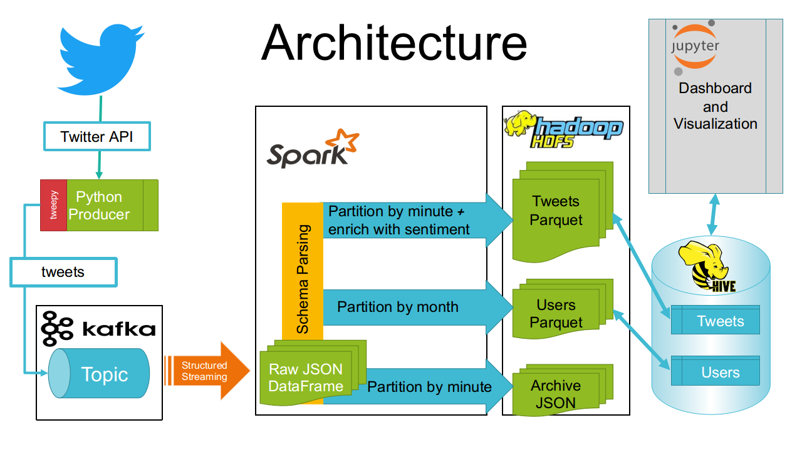

# Data Engineer Course Project
by [Michael Berger](https://www.linkedin.com/in/michael-berger-e/ "My LinkedIn")

## About
This is my final project for Data Engineer Expert course at Naya College.  
The goal of this project is to create a multi-purpose platform that acquires data from the Twitter developers API (in real-time), based on certain keywords of interest. Once the data is collected, the platform wil perform data filtering, cleansing and enrichment to perform analytical operations for the organizational and business purposes and to transform raw data into knowledge.

## Requirements
To run this platform you will need:  
- A modern machine with at least 16 GB RAM and 100 GB Storage
- A cluster of these, in case you want to use the platform at any significant scale
- A Hadoop distribution ([Cloudera QuickStart Virtual Machine](https://www.cloudera.com/downloads/quickstart_vms/5-13.html)  will be sufficient)

## Installation
- Set up your Virtual Machine
- Git clone the repo to your home dir
- Run file configure_environment.sh
- Edit configuration in config.py according to your liking / working environment 

## Usage
- Run notebook HDFS_DB_Init.ipynb from start to end. This will create HDFS directories and HIVE tables  
- Run notebook twitter_Producer.ipynb from start to end. It will start receiveing tweets from twitter API and sending them to Kafka topic.  
- Run notebook Spark_Consumer.ipynb. It will start processing data in Spark, writing it to HDFS and refreshing HIVE tables. Do not run one-line-cells below the df statements. These are for monitoring and debugging only.  
- Run notebook Dashboard.ipynb to see some graphs and distributions of data being collected

The files HDFS_Consumer.ipynb, HIVE_Consumer.ipynb and Sandbox.ipynb are generally not needed. The may stay as examples of various code snippets

